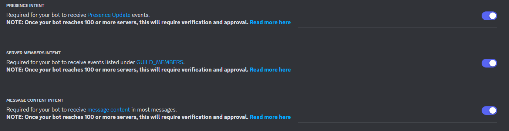

# DevSoc Discord Bot

A repository containing the DevSoc discord server's python bot.

Originally Created by [@emiipo](https://github.com/emiipo)

Previously maintained/updated by [@petelampy](https://github.com/petelampy)

Maintained/updated by [@devj4y](https://github.com/devj4y)

Discord.py v2.x and Docker rewrite by [@AndehUK](https://github.com/AndehUK)

## Preparing your Environment Variables

Copy the `.env.example` file in the root of the project and name it `.env`, don't worry this will be ignored by git and will not be pushed to the repository should you make any contributions to the github repository. Populate the `BOT_TOKEN` variable with your bot token. If you do not know how to create a bot application and get your bot token, you can follow [this guide](https://discordjs.guide/preparations/setting-up-a-bot-application.html#creating-your-bot).

**NOTE:** When creating your bot application, ensure that all **ALL 3** Privileged Gateway Intents are enabled.



Now simply copy and paste your token into the `BOT_TOKEN` variable and you're good to go!

```py
BOT_TOKEN="YOUR_TOKEN_HERE"
```

## How to run the bot (With Docker)?

If you plan to run the bot via docker, it is very simple to do so. This assumes you already have docker installed and available on your machine. If you are not running the bot via docker, you can safely ignore this section and skip to [How to run the bot (Without Docker)](#how-to-run-the-bot-without-docker)

**Build the Docker Image**

Run this command in the root directory of the project.

```sh
docker build -t devsoc-discord-bot .
```

**Run the Discord Bot**

After the Docker Image is built, you can run the discord bot by running this command.

```sh
docker run devsoc-discord-bot
```

## How to run the bot (Without Docker)?

**Create a Virtual Environment:**

Virtual Environments help separate our development environments and installed packages on a project-by-project basis. To create and access a virtual environment, run the following commands:

```sh
# Linux / MacOS
python3 -m venv .venv
source .venv/bin/activate

# Windows
py -3 -m venv .venv
.\.venv\Scripts\activate
```

To deactivate or exit your virtual environment, simply type `deactivate` in your terminal.

**Install Python Packages**

In order to run our Discord Bot we need to install some packages. To do this, ensure you are inside your virtual environment and run the following command:

```sh
# Linux / MacOS
python3 -m pip install -r requirements.txt

# Windows
pip install -r requirements.txt
```

**Add to your `.env` file:**

If you are not running the bot with docker, some of the environment variable handling that is done automatically, will not be taken care of, so we need to do this manually. This is simple though, all we need to do is copy and paste some additional values into our `.env` file before running the bot!

**Copy and Paste the following lines into your `.env` file underneath the `BOT_TOKEN` variable:**

```py
# Jishaku Config
JISHAKU_NO_UNDERSCORE="true"
JISHAKU_NO_DM_TRACEBACK="true"
JISHAKU_HIDE="true"
```

For more information on Jishaku, please read [What is Jishaku?](#what-is-jishaku)

**Now you can safely run the bot!**

**NOTE:** This bot has only been tested on version `3.11.7`. If you run into issues when running the bot on a different version, you may have to install [python 3.11.7](https://www.python.org/downloads/release/python-3117/)

```sh
# Linux / MacOS
python3 launcher.py

# Windows
py -3 launcher.py
```

## What is a cog?

In discord.py's commands extension, it supports custom extensions called cogs that are hot-reloadable meaning you can load, unload and reload commands and event listeners without restarting the bot process. This is also great for organising your commands and listeners into different files.

## What is jishaku?

Jishaku is a dynamic, easy-to-use extension for discord.py bot developers that enables rapid prototyping, experimentation, and debugging of features for bots. You can read more about jishaku from their [GitHub Page](https://github.com/Gorialis/jishaku) and their [Documentation](https://jishaku.readthedocs.io/en/latest/).

## Adding a slash command

To add a command, either add a new command definition in an existing cog where your command would belong in, or create a new cog. Cogs belong in the cogs folder found in the root directory.

```python
from discord import app_commands
from discord.ext import commands


class MyCog(commands.Cog):
    def __init__(self, bot: commands.Bot):
        self.bot = bot

    @app_commands.command(name="ping", description="Pong!")
    async def ping_command(self, interaction: discord.Interaction):
        await interaction.response.send_message("Pong!", ephemeral=True)

    @commands.Cog.listener("on_member_join")
    async def welcome_member_listener(self, member: discord.Member):
        channel = member.guild.get_channel(783388268631818280)
        await channel.send(
            "Welcome {member.mention}! Head to <#804817413841354843> to accept our server "
            "rules, then head to <#785558941688922152> to set your roles using Reaction "
            "Roles and access the rest of the server."
        )


async def setup(bot: commands.Bot):
    await bot.add_cog(MyCog(bot))
```

You can find more on slash commands [here](https://discordpy.readthedocs.io/en/stable/interactions/api.html#command)

## API Documentation

The documentation for the API can be found [here](https://discordpy.readthedocs.io/en/stable/index.html)

## Requirements

- [Python v3.11.7](https://www.python.org/downloads/release/python-3117/)
- [discord.py v2.3.2](https://github.com/Rapptz/discord.py)
